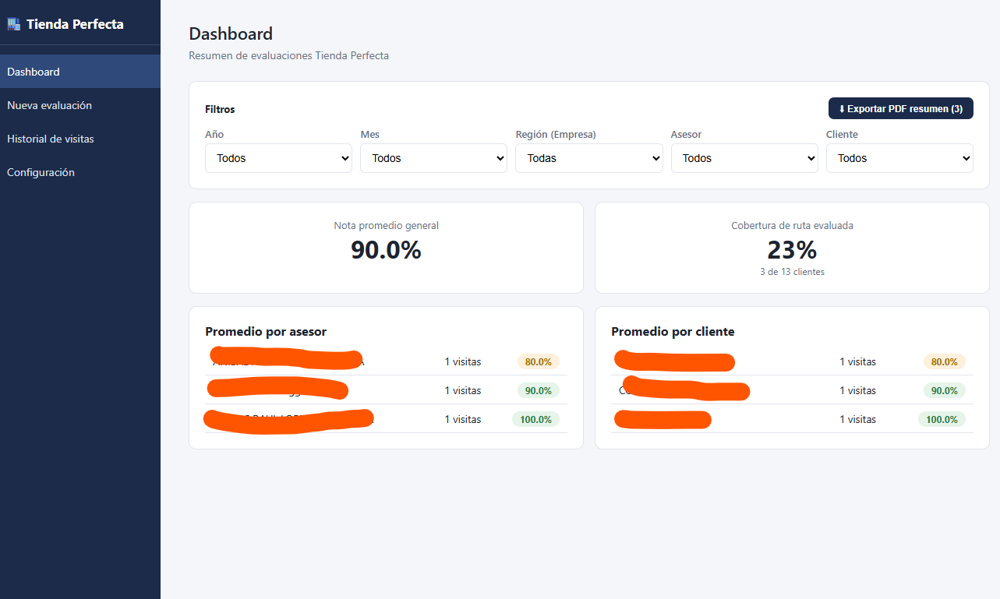
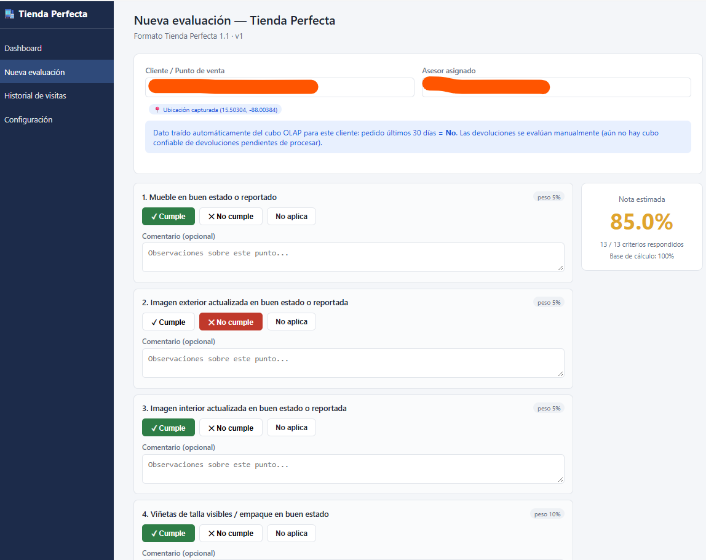
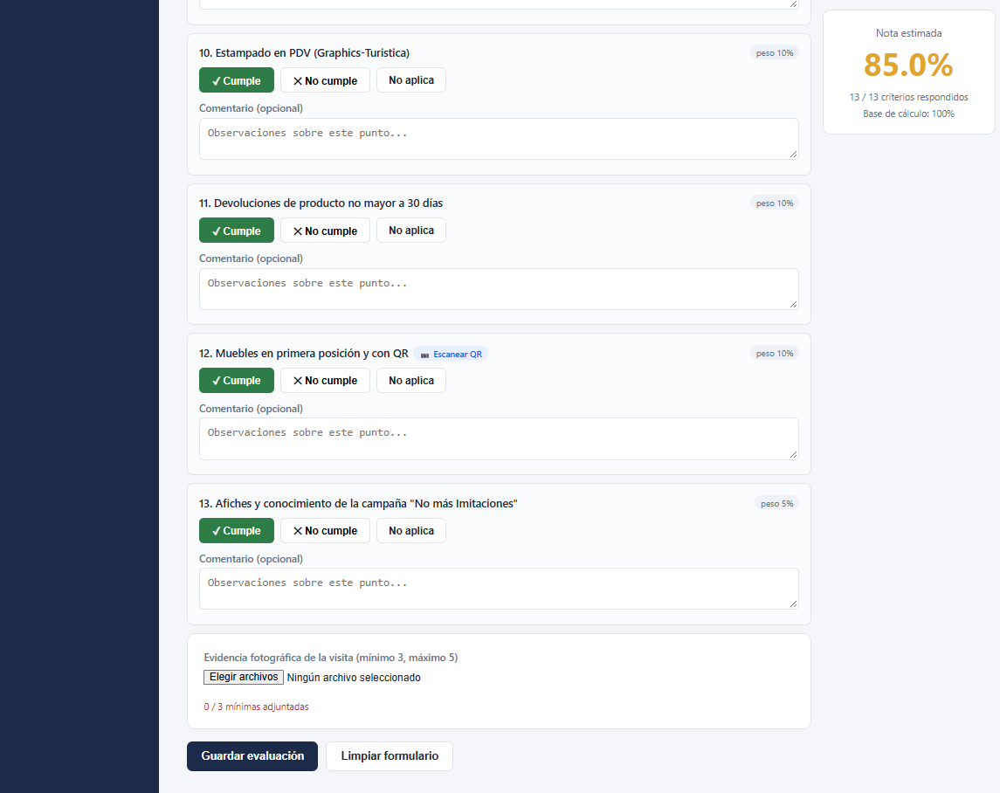
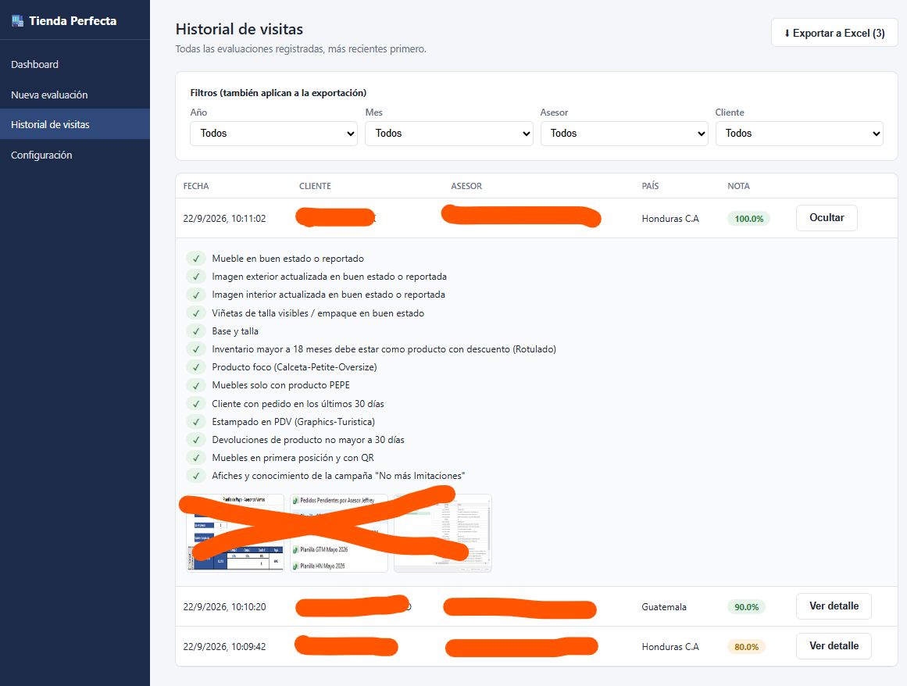
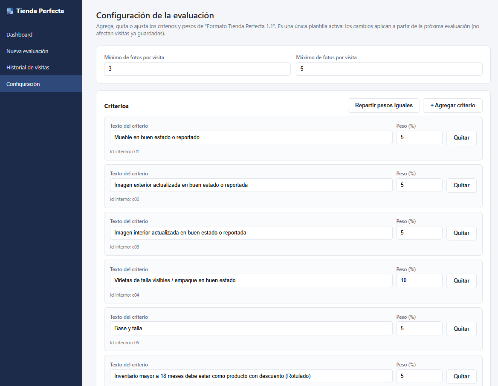

# 🏪 Perfect Store Evaluation
Digitalizing the Trade Marketing Store Evaluation Process 
## Using Claude AI
A web application designed to digitize, centralize, and simplify the monthly Perfect Store Evaluation process used by Trade Marketing teams to assess brand execution across retail stores.

The application replaces a manual workflow based on Excel evaluations + photographic evidence + PowerPoint presentations with a single digital workflow that allows users to perform evaluations, attach evidence, calculate scores, and automatically generate a PDF report.

## 🎯 The Problem

The original process required Trade Marketing personnel to work across multiple tools:

┌──────────────┐
│    Excel     │
│  Evaluation  │
└──────┬───────┘
       │
       ▼
┌──────────────┐
│ Store Visit  │
│ & Photos     │
└──────┬───────┘
       │
       ▼
┌──────────────┐
│  PowerPoint  │
│    Report    │
└──────────────┘

This involved repetitive manual work and made it difficult to maintain the evaluation whenever questions or scoring criteria changed.

## 💡 The Solution

The Perfect Store Evaluation application brings the entire process into one platform:

Customer
   ↓
Sales Advisor
   ↓
Store
   ↓
Evaluation
   ↓
Photographic Evidence
   ↓
Automatic Score
   ↓
PDF Report

## ✨ Features
Feature	Description
👤 Customer Selection	Select customers from available business data
🧑‍💼 Sales Advisor	Select the advisor associated with the customer
🏪 Store Evaluation	Complete the evaluation directly in the application
📋 Dynamic Questions	Add, edit, or modify evaluation questions
⚖️ Configurable Weighting	Assign different values to each question
📊 Automatic Scoring	Calculate the final score automatically
📸 Photo Evidence	Attach photographic evidence to the evaluation
📄 PDF Reports	Generate a complete evaluation summary automatically
🔗 OLAP Integration	Retrieve business information from company OLAP sources
📸 Application Preview
01 — Application

02 — Store Evaluation

03 — Evaluation Questionnaire

04 — Evaluation Results

05 — Report / Evidence

## 📄 Generated Report

One of the main objectives of the application is to eliminate the need to manually create a PowerPoint presentation after completing an evaluation.

The application automatically generates a PDF summary containing the evaluation results and photographic evidence.

Example Report

## 📎 View Sample PDF Report

The PDF included in this repository is provided as a portfolio example and uses sample/anonymized information.

## 📊 Evaluation Model

The evaluation is based on a configurable set of questions, typically 15–18 questions covering different aspects of brand execution within the store.

Each question can have its own weighting, while the total evaluation is normalized to 100%.

For example:

Question 01  ─────────── 10%
Question 02  ─────────── 15%
Question 03  ───────────  5%
Question 04  ─────────── 10%
Question 05  ─────────── 20%
Question 06  ─────────── 15%
Question 07  ─────────── 10%
Question 08  ─────────── 15%
                    ─────────
                       100%

This makes the evaluation model flexible and allows the business criteria to evolve without requiring changes to the application's core workflow.

## 🏗️ Architecture

The application follows a separated frontend/backend architecture:

                    ┌─────────────────────┐
                    │       WEB APP       │
                    │      Frontend       │
                    └──────────┬──────────┘
                               │
                               │ API
                               ▼
                    ┌─────────────────────┐
                    │        API          │
                    │      Backend        │
                    └──────────┬──────────┘
                               │
                               ▼
                    ┌─────────────────────┐
                    │    OLAP DATA        │
                    │  Enterprise Data    │
                    └─────────────────────┘

## Frontend

The web directory contains the user interface and evaluation workflow.

## Backend

The api directory contains the application's business logic, data processing, scoring calculations, and report generation.

Enterprise Data Integration

The application was designed to connect to the company's OLAP cubes to retrieve information such as:

Customers

Sales advisors

Customer/advisor relationships

Other relevant business information

Because these data sources belong to the company's internal infrastructure, the production data integration is not publicly accessible.

## 📁 Project Structure
perfect-store-evaluation/
│
├── api/                    # Backend / API
│
├── web/                    # Frontend application
│
├── screenshots/            # Application screenshots
│   ├── 1.png
│   ├── 2.png
│   ├── 3.png
│   ├── 4.png
│   └── 5.png
│
├── TiendaPerfecta_Resumen.pdf       # Example generated report
│
├── .gitignore
└── README.md

## 🧩 Business Workflow

The application was designed around the actual workflow used by Trade Marketing teams:

Before
Excel
  │
  ├── Manual evaluation
  │
  ▼
Store visit
  │
  ├── Take photos
  │
  ▼
PowerPoint
  │
  ├── Copy results
  ├── Copy photos
  └── Format presentation

With the Application
                    ┌───────────────┐
                    │    Customer   │
                    └───────┬───────┘
                            ↓
                    ┌───────────────┐
                    │ Sales Advisor │
                    └───────┬───────┘
                            ↓
                    ┌───────────────┐
                    │     Store     │
                    └───────┬───────┘
                            ↓
                    ┌───────────────┐
                    │  Evaluation   │
                    └───────┬───────┘
                            ↓
                    ┌───────────────┐
                    │ Photo Evidence│
                    └───────┬───────┘
                            ↓
                    ┌───────────────┐
                    │ Automatic     │
                    │    Scoring    │
                    └───────┬───────┘
                            ↓
                    ┌───────────────┐
                    │  PDF Report   │
                    └───────────────┘

## 🛠️ Technology & Architecture

The project is organized into two main applications:

Frontend

Web-based user interface

Dynamic evaluation forms

Store evaluation workflow

Question configuration

Backend

API

Business logic

Score calculation

Report generation

Enterprise data integration

Data

OLAP cube integration

Customer information

Sales advisor information

## 🔐 Data & Privacy

This repository is intended as a portfolio demonstration.

The production application integrates with internal company data sources that are not publicly accessible.

For that reason:

No company credentials are included.

No production connection strings are included.

Screenshots and sample reports should contain only anonymized or non-sensitive information.

The OLAP integration shown in the architecture represents the production environment but is not publicly accessible.

## 🚀 Future Improvements

Potential future enhancements include:

🔐 Authentication and role-based access

📊 Historical evaluation dashboards

📈 Store and advisor performance tracking

📧 Automatic distribution of reports

☁️ Cloud deployment

📱 Mobile optimization for store visits

📴 Offline evaluation capabilities

📊 Historical comparison between evaluations

## 🤖 Development

This project was developed with the assistance of Claude, using an iterative development approach to design, implement, and refine the application.

The main objective was to transform an existing manual business process into a centralized digital workflow while maintaining flexibility in the evaluation criteria and scoring model.

## 📌 Project Summary

Project: Perfect Store Evaluation
Area: Trade Marketing / Retail Execution
Purpose: Digitalize store evaluation and reporting
Architecture: Frontend + Backend + Enterprise Data Integration
Output: Automated PDF Evaluation Report

Note: This repository showcases the application architecture and user experience. Production data integrations depend on internal company infrastructure and are therefore not publicly accessible.
